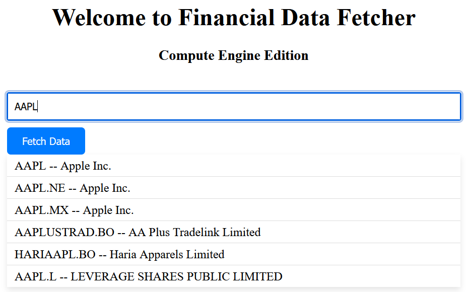
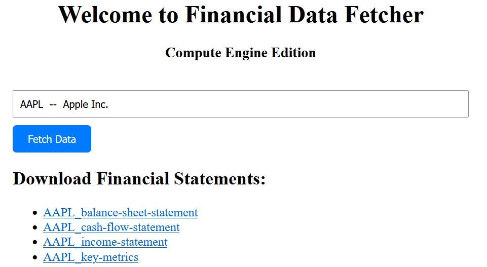

# Financial Data Fetcher - Compute Engine Edition


This project hosts a web server on Google Cloud using Compute Engine to fetch and display financial data for companies. The application uses Flask for the backend and serves a simple frontend for user interaction.

## Table of Contents
- [Installation](#installation)
- [Usage](#usage)
- [Contributing](#contributing)
- [License](#license)
- [Contact](#contact)

## Installation

### Prerequisites
- Google Cloud Platform (GCP) account
- GCP Project with billing enabled
- Google Cloud SDK or Google Cloud Console
- An FMP API Key (from [Financial Modeling Prep](https://financialmodelingprep.com/))

### Setup

1. **Setup Google Cloud VM**
    - Create a new VM instance in Google Cloud Compute Engine.
    - Choose the `f1-micro` machine type.
    - Select `Debian` as the operating system.
    - Enable HTTP and HTTPS traffic.

2. **Connect to VM**
    ```sh
    gcloud compute ssh <your-vm-name>
    ```

3. **Set Environment Variables on VM**
    - You will need to set your `FLASK_SECRET_KEY`, `FLASK_ENV`, and `FMP_API_KEY`. Add these to your `.bashrc` or `.bash_profile` file:
    ```sh
    export FLASK_SECRET_KEY='your_secret_key'
    export FLASK_ENV='production'
    export FMP_API_KEY='your_fmp_api_key'
    source ~/.bashrc
    ```

4. **Clone the Repository onto the VM**
    ```sh
    git clone https://github.com/oldhiltonian/fdf-ce.git
    ```

5. **Run Setup Script**
    ```sh
    cd ~/financial-data-fetcher
    chmod +x setup.sh
    ./setup.sh
    ```


## Usage

1. **Access the Application**
   - Open your browser and go to the external IP of your VM.
   - You should see the homepage of the Financial Data Fetcher.

2. **Fetch Financial Data**
   - Start typing a company name in the search bar.
   - Select the company from the suggestions.
   - Click "Fetch Data" to retrieve financial statements.
   - Download links for the financial statements will appear below the form.


## License

Distributed under the MIT License. 

## Contact

Project Link: [https://github.com/oldhiltonian/fdf-ce.git](https://github.com/oldhiltonian/fdf-ce.git)
